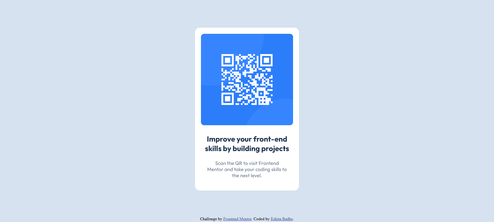

# Frontend Mentor - QR code component solution

This is a solution to the [QR code component challenge on Frontend Mentor](https://www.frontendmentor.io/challenges/qr-code-component-iux_sIO_H). Frontend Mentor challenges help you improve your coding skills by building realistic projects. 

## Table of contents

- [Overview](#overview)
  - [Screenshot](#screenshot)
  - [Links](#links)
- [My process](#my-process)
  - [Built with](#built-with)
  - [What I learned](#what-i-learned)
  - [Continued development](#continued-development)
- [Author](#author)

## Overview

This solution includes HTML and CSS code for the card component containg QR image and text.

### Screenshot

### Links

- Solution URL: [Solution](https://github.com/Eshita-Badhe/QR-code-component)
- Live Site URL: [QR-code-component](https://eshita-badhe.github.io/QR-code-component/)

## My process

Solved the challenge by following the steps:
- Step 1: Divided the components into containers like (card, image, title, text) and added the respective content.
- Step 2: Observed the given design (ref image) and style-guide 
- Step 3: Accordingly gave CSS styling to each container starting from body, then card and then finally text.

### Built with

- Semantic HTML5 markup
- CSS custom properties
- Flexbox
- Mobile-first workflow
- [Google Fonts](https://fonts.google.com/specimen/Outfit)

### What I learned

I learned how we can style components as it is as given in the sample and how the styling will get updated according to the screen (relative).

### Continued development

- CSS attributes

## Author

- Website - [Eshita Badhe](https://eshita-badhe.netlify.app/)
- Frontend Mentor - [@eshitabadhe](https://www.frontendmentor.io/profile/Eshita-Badhe)